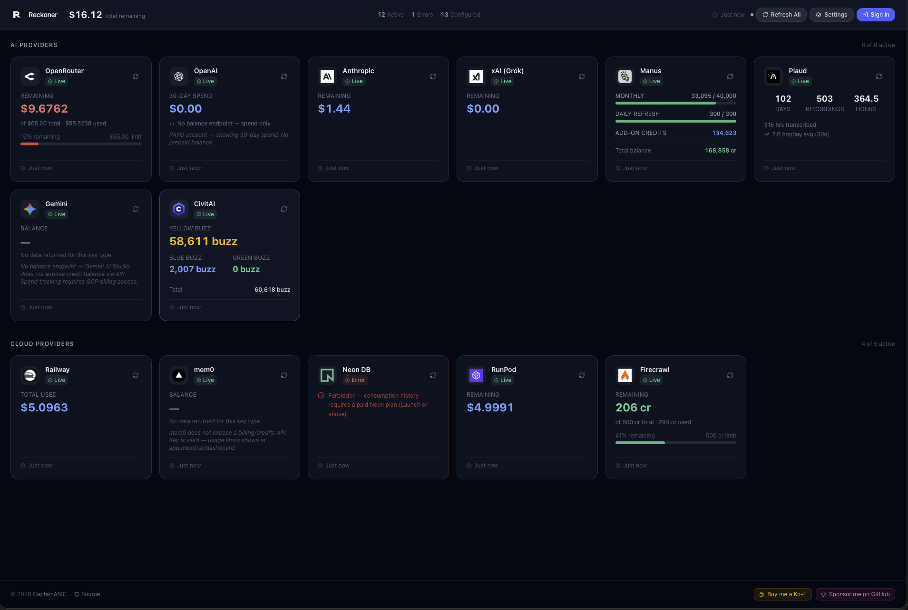

<p align="center">
  <picture>
    <source media="(prefers-color-scheme: dark)" srcset="frontend/public/reckoner-white.png" />
    <source media="(prefers-color-scheme: light)" srcset="frontend/public/reckoner-dark.png" />
    
  </picture>
</p>

<h1 align="center">Reckoner</h1>

<p align="center">
  A fast, single-page dashboard for monitoring AI service credits, cloud billing, and account balances across OpenRouter, OpenAI, Anthropic, xAI, Mistral, Groq, Manus, Plaud, CivitAI, Railway, Neon, RunPod, mem0, AWS, GCP, Vercel, and more.
</p>

<p align="center">
  <a href="https://www.gnu.org/licenses/gpl-3.0"></a>
  <a href="https://www.python.org/downloads/"></a>
  <a href="https://react.dev/"></a>
  <a href="https://fastapi.tiangolo.com/"></a>
  <a href="https://github.com/CaptainASIC/reckoner/stargazers"></a>
  <a href="https://github.com/CaptainASIC/reckoner/issues"></a>
  <a href="https://ko-fi.com/captasic"></a>
  <a href="https://github.com/sponsors/CaptainASIC"></a>
</p>

<p align="center">
  <a href="https://reckoner.captainasic.dev">Live Demo</a> · <a href="#quick-start">Quick Start</a> · <a href="#provider-support">Providers</a> · <a href="#adding-a-new-provider">Add Your Own</a>
</p>

<p align="center">
  
</p>

## Features

- **Single dashboard** — all your AI and cloud provider balances at a glance
- **Auto-refresh** — balances update every 60 seconds in the browser, with background polling every 5–30 minutes
- **Live refresh** — force an immediate refresh of any provider or all at once
- **In-app settings** — configure credentials directly from the dashboard UI
- **Password auth** — optional single-user password gate to protect settings and/or the full dashboard
- **Railway-ready** — two-service deploy (frontend + backend) with `uv` and Railpack
- **Docker support** — multi-stage Dockerfile included

## Provider Support

| Provider | Category | Auth Required | What It Shows |
|----------|----------|---------------|---------------|
| **OpenRouter** | AI | API Key | Prepaid credit balance |
| **OpenAI** | AI | API Key + Admin Key (optional) | Key validity; 30-day spend with Admin key |
| **Anthropic** | AI | Session Cookie + Org ID | Prepaid credit balance |
| **xAI (Grok)** | AI | Management Key + Team ID | Prepaid credit balance |
| **Mistral AI** | AI | Session Cookie | Best-effort balance |
| **Groq** | AI | Session Cookie | Best-effort balance |
| **Manus** | AI | JWT Bearer Token | Monthly credits, daily refresh, add-on balance |
| **Gemini** | AI | API Key | Key validity only (no balance endpoint) |
|| **Plaud** | AI/Tools | JWT Bearer Token | Recording stats (files, hours, transcription) |
|| **CivitAI** | AI | Session Cookie | Buzz credit balance |
| **Railway** | Cloud | Account API Token | Credit balance + current billing period spend |
| **Vercel** | Cloud | Personal Access Token | Account details |
| **Neon DB** | Cloud | API Key | Monthly compute consumption |
| **RunPod** | Cloud | API Key | Credit balance |
|| **Firecrawl** | Cloud | API Key | Remaining/total credits + billing period |
|| **mem0** | Tools | API Key | Key validity + memory count |
| **AWS** | Cloud | IAM Key + Secret | Month-to-date spend via Cost Explorer |
| **GCP** | Cloud | Service Account JSON | Month-to-date billing spend |

## Quick Start

### Local Development

**Prerequisites:** Python 3.11+, Node.js 22+, pnpm, uv

```bash
# Clone the repo
git clone https://github.com/CaptainASIC/reckoner
cd reckoner

# Backend
cd backend
uv sync
cp ../.env.example ../.env
# Edit .env with your credentials
uv run uvicorn main:app --reload --port 8000

# Frontend (separate terminal)
cd frontend
pnpm install
VITE_API_URL=http://localhost:8000 pnpm dev
```

Open http://localhost:5173 for the dashboard.

### Deploy to Railway

1. Fork or push this repo to GitHub
2. Create a new Railway project → **Deploy from GitHub repo**
3. Add two services, both pointing to the same repo:
   - **Backend** — root directory: `/backend`
   - **Frontend** — root directory: `/frontend`
4. Add environment variables in each service's **Variables** tab (see `.env.example`)
5. Set `VITE_API_URL` in the frontend service to the backend's public URL
6. Done — Railway provides public URLs for both services

### Deploy with Docker

```bash
docker build -t reckoner .
docker run -p 8000:8000 --env-file .env reckoner
```

## Configuration

### Environment Variables

Copy `.env.example` to `.env` and fill in your credentials. All variables are optional — only configure the services you use.

### Authentication

Reckoner supports optional single-user password authentication to prevent unauthorized access:

| Variable | Default | Description |
|----------|---------|-------------|
| `RECKONER_PASSWORD` | *(empty — auth disabled)* | Set a password to enable auth. All settings endpoints require login. |
| `RECKONER_PROTECT_DASHBOARD` | `true` | When `true`, viewing balances also requires login. Set to `false` to keep the dashboard public while still protecting settings. |

When `RECKONER_PASSWORD` is not set, auth is completely disabled and the dashboard behaves as before.

Tokens are issued as JWTs with a 30-day expiry and are invalidated on backend redeploy.

### In-App Settings

Click the ⚙️ icon on any provider card to configure credentials directly in the dashboard. Settings are persisted in the local SQLite database.

## Getting Credentials

### OpenRouter
1. Go to [openrouter.ai/settings/keys](https://openrouter.ai/settings/keys)
2. Create an API key
3. Set `OPENROUTER_API_KEY`

### OpenAI
1. Go to [platform.openai.com/api-keys](https://platform.openai.com/api-keys) for a standard key
2. Optionally, go to [platform.openai.com/settings/organization/admin-keys](https://platform.openai.com/settings/organization/admin-keys) for an Admin key
3. Set `OPENAI_API_KEY` and optionally `OPENAI_ADMIN_KEY`

### Anthropic
1. Log in to [platform.claude.com](https://platform.claude.com)
2. Open DevTools (F12) → Network tab
3. Find a request to `/api/organizations/<org-id>/prepaid/credits`
4. Copy the `org_id` from the URL and the `sessionKey` from the Cookie header
5. Set `ANTHROPIC_ORG_ID` and `ANTHROPIC_SESSION_COOKIE`

### xAI (Grok)
1. Log in to [console.x.ai](https://console.x.ai)
2. Go to Settings → Management Keys → Create a key
3. Find your Team ID in the console URL or account settings
4. Set `XAI_MANAGEMENT_KEY` and `XAI_TEAM_ID`

### Manus
1. Log in to [manus.im](https://manus.im)
2. Open DevTools (F12) → Network tab → filter by `api.manus.im`
3. Click any request → Headers → copy the value after `Bearer ` in the Authorization header
4. Set `MANUS_API_KEY` — token is valid for ~90 days

### Plaud
1. Log in to [web.plaud.ai](https://web.plaud.ai)
2. Open DevTools (F12) → Network tab → filter by `api.plaud.ai`
3. Click any request → Headers → copy the value after `Bearer ` in the Authorization header
4. Set `PLAUD_API_KEY` — token is valid for ~5 months

### CivitAI
1. Log in to [civitai.com](https://civitai.com)
2. Open DevTools (F12) → Application → Cookies
3. Copy the full Cookie header string (at minimum the `__Secure-civitai-token` cookie)
4. Set `CIVITAI_SESSION_COOKIE`

### Railway
1. Go to [railway.app/account/tokens]
2. Create a new token — **select "No workspace"** to create an Account token
3. Set `RAILWAY_CREDIT_TOKEN` (not `RAILWAY_API_KEY` — Railway injects that automatically)

### Neon DB
1. Go to [console.neon.tech/app/settings/api-keys](https://console.neon.tech/app/settings/api-keys)
2. Create an API key
3. Set `NEON_API_KEY`
> Note: Consumption API requires Launch plan or above.

### RunPod
1. Go to [runpod.io/console/user/settings](https://runpod.io/console/user/settings) → API Keys
2. Create an API key
3. Set `RUNPOD_API_KEY`

### Firecrawl
1. Go to [firecrawl.dev/app/api-keys](https://firecrawl.dev/app/api-keys)
2. Create an API key
3. Set `FIRECRAWL_API_KEY`

### mem0
1. Go to [app.mem0.ai/dashboard/api-keys](https://app.mem0.ai/dashboard/api-keys)
2. Create an API key (`m0-...`)
3. Set `MEM0_API_KEY`

### AWS
1. Create an IAM user with `ce:GetCostAndUsage` permission
2. Generate access keys
3. Set `AWS_ACCESS_KEY_ID`, `AWS_SECRET_ACCESS_KEY`, and `AWS_DEFAULT_REGION`

### GCP
1. Create a service account with `roles/billing.viewer`
2. Download the JSON key file
3. Set `GCP_SERVICE_ACCOUNT_JSON` (full JSON contents) and `GCP_BILLING_ACCOUNT_ID`

## Architecture

```
reckoner/
├── backend/                  # FastAPI application
│   ├── main.py               # App entry point
│   ├── auth.py               # Password auth + JWT tokens
│   ├── scheduler.py          # Background balance refresh
│   ├── config_manager.py     # Settings persistence
│   ├── models/
│   │   ├── database.py       # SQLite schema + connection
│   │   └── schemas.py        # Pydantic v2 models
│   ├── routers/
│   │   ├── auth.py           # Login + auth status endpoints
│   │   ├── credits.py        # Dashboard + refresh endpoints
│   │   ├── health.py         # Health check
│   │   └── settings.py       # Provider credential management
│   └── providers/            # One file per service
│       ├── base.py           # Abstract base class
│       ├── openrouter.py
│       ├── openai.py
│       ├── anthropic.py
│       ├── xai.py
│       ├── mistral.py
│       ├── groq.py
│       ├── manus.py
│       ├── plaud.py
│       ├── gemini.py
│       ├── civitai.py
│       ├── railway.py
│       ├── vercel.py
│       ├── neon.py
│       ├── runpod.py
│       ├── firecrawl.py
│       ├── mem0.py
│       ├── aws.py
│       └── gcp.py
├── frontend/                 # React + TypeScript + Tailwind
│   └── src/
│       ├── App.tsx
│       ├── components/
│       │   ├── ProviderCard.tsx
│       │   ├── SettingsModal.tsx
│       │   └── SummaryBar.tsx
│       ├── hooks/
│       │   ├── useAuth.ts
│       │   ├── useDashboard.ts
│       │   └── useSettings.ts
│       ├── pages/
│       │   ├── LoginPage.tsx
│       │   └── SettingsPage.tsx
│       ├── types/index.ts
│       └── utils/
│           ├── api.ts
│           └── format.ts
├── .env.example              # Environment variable template
└── README.md
```

## API Reference

| Endpoint | Method | Description | Auth |
||----------|--------|-------------|------|
| `GET /api/health` | GET | Health check | Public |
| `GET /api/auth/status` | GET | Auth status (enabled, dashboard protected, authenticated) | Public |
| `POST /api/auth/login` | POST | Login with password, returns JWT | Public |
| `GET /api/credits/` | GET | Full dashboard (cached) | Protected* |
| `POST /api/credits/refresh` | POST | Refresh all providers | Protected* |
| `POST /api/credits/refresh/{id}` | POST | Refresh single provider | Protected* |
| `GET /api/credits/providers` | GET | List providers with metadata | Protected* |
| `GET /api/settings/providers` | GET | Get settings (masked) | Auth required |
| `PUT /api/settings/providers/{id}` | PUT | Update provider credentials | Auth required |

\* Protected when `RECKONER_PROTECT_DASHBOARD=true` (default). Public when set to `false`.

Interactive docs available at `/docs` (FastAPI Swagger UI).

## Adding a New Provider

1. Create `backend/providers/yourprovider.py` extending `BaseProvider`
2. Implement `fetch_balance()` and `is_configured()`
3. Register in `backend/providers/__init__.py`
4. That's it — the dashboard picks it up automatically

## License

This project is licensed under the [GNU General Public License v3.0](LICENSE).
